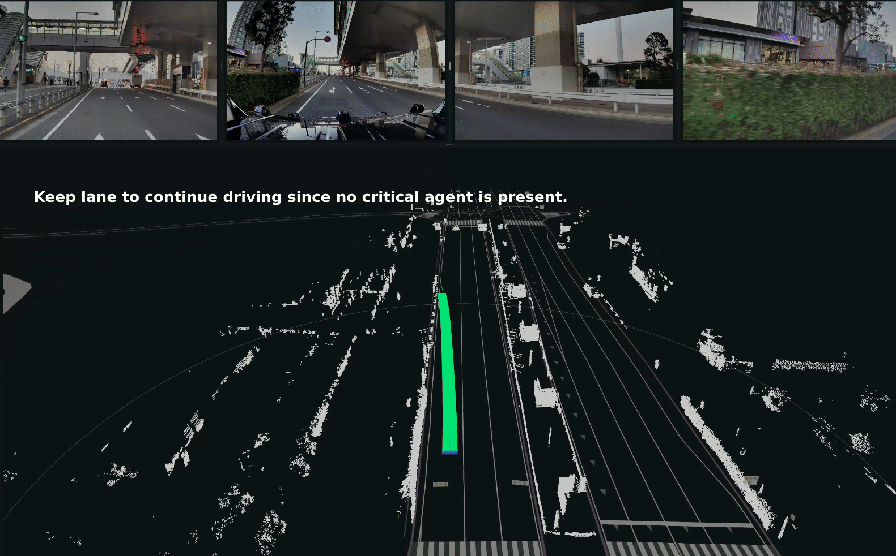

# Alpamayo ROS 2 Node Usage Guide



This guide explains how to set up and run the Alpamayo ROS 2 node.

## Prerequisites

| Requirement | Specification                                |
| ----------- | -------------------------------------------- |
| **Python**  | 3.10.x (for compatibility with ROS 2 Humble) |
| **ROS 2**   | Humble (must be installed)                   |
| **GPU**     | NVIDIA GPU (24 GB+ VRAM recommended)         |
| **OS**      | Linux (tested)                               |

## Setup Instructions

### 1. Install uv

If not already installed, install uv using the following command:

```bash
curl -LsSf https://astral.sh/uv/install.sh | sh
export PATH="$HOME/.local/bin:$PATH"
```

### 2. Create Virtual Environment with Python 3.10

**Important**: You must use Python 3.10 for compatibility with ROS 2 Humble.

Remove any existing venv and recreate it with Python 3.10:

```bash
# Remove existing venv (if it exists)
rm -rf a1_5_venv

# Create new venv with Python 3.10
uv venv a1_5_venv --python python3.10

# Activate the virtual environment
source a1_5_venv/bin/activate

# Install dependencies
uv sync --active
```

### 3. HuggingFace Authentication

Request access to the Alpamayo model and dataset:

- [Physical AI AV Dataset](https://huggingface.co/datasets/nvidia/PhysicalAI-Autonomous-Vehicles)
- [Alpamayo Model Weights](https://huggingface.co/nvidia/Alpamayo-1.5-10B)

Once access is granted, authenticate using the HuggingFace CLI:

```bash
# Install HuggingFace Hub (if not already installed)
pip install huggingface_hub

# Login with your token
huggingface-cli login
```

You can obtain your access token at: <https://huggingface.co/settings/tokens>

## Running the ROS 2 Node

### Method 1: Direct Script Execution (Recommended)

Source the ROS 2 environment and run the node using Python from the virtual environment:

```bash
# Source ROS 2 environment
source /opt/ros/humble/setup.bash

# Source Autoware environment (need to change correct path)
source ~/workspace/autoware/install/setup.bash

# Activate virtual environment
source a1_5_venv/bin/activate

# Run the node
python3 ./src/alpamayo_ros/alpamayo_ros/alpamayo_node.py --ros-args -p camera_topics:="['/sensing/camera/camera3/image_raw/compressed', '/sensing/camera/camera1/image_raw/compressed', '/sensing/camera/camera4/image_raw/compressed', '/sensing/camera/camera2/image_raw/compressed']"

# Run the node (rosbag mode)
# python3 ./src/alpamayo_ros/alpamayo_ros/alpamayo_node.py --ros-args -p camera_topics:="['/sensing/camera/camera3/image_raw/compressed', '/sensing/camera/camera1/image_raw/compressed', '/sensing/camera/camera4/image_raw/compressed', '/sensing/camera/camera2/image_raw/compressed']" -p use_sim_time:=true

```

### Method 2: Using colcon Build

If you want to build as a ROS 2 package using colcon:

```bash
# Source ROS 2 environment
source /opt/ros/humble/setup.bash

# Source Autoware environment (need to change correct path)
source ~/workspace/autoware/install/setup.bash
# Activate virtual environment
source a1_5_venv/bin/activate

# Build the package
colcon build --packages-select alpamayo_ros --symlink-install

# Source the workspace
source install/setup.bash

# Run the node
python3 ./src/alpamayo_ros/alpamayo_ros/alpamayo_node.py --ros-args -p camera_topics:="['/sensing/camera/camera3/image_raw/compressed', '/sensing/camera/camera1/image_raw/compressed', '/sensing/camera/camera4/image_raw/compressed', '/sensing/camera/camera2/image_raw/compressed']"

# Run the node (rosbag mode)
# python3 ./src/alpamayo_ros/alpamayo_ros/alpamayo_node.py --ros-args -p camera_topics:="['/sensing/camera/camera3/image_raw/compressed', '/sensing/camera/camera1/image_raw/compressed', '/sensing/camera/camera4/image_raw/compressed', '/sensing/camera/camera2/image_raw/compressed']" -p use_sim_time:=true

```

### Method 3: Using Launch File

If a launch file is available:

```bash
# Source ROS 2 environment and workspace
source /opt/ros/humble/setup.bash
source a1_5_venv/bin/activate

# Source Autoware environment (need to change correct path)
source ~/workspace/autoware/install/setup.bash

# Run the launch file
ros2 launch alpamayo_ros alpamayo.launch.py
```

## Parameters

The Alpamayo node can be configured with the following ROS parameters:

| Parameter                | Default Value                    | Description                                        |
| ------------------------ | -------------------------------- | -------------------------------------------------- |
| `camera_topics`          | (required)                       | List of camera image topics (CompressedImage type) |
| `odometry_topic`         | `/localization/kinematic_state`  | Odometry topic                                     |
| `trajectory_topic`       | `/alpamayo/predicted_trajectory` | Output topic for predicted trajectory              |
| `cot_topic`              | `/alpamayo/reasoning`            | Output topic for reasoning trace                   |
| `cot_with_stamped_topic` | `/alpamayo/reasoning_stamped`    | Output topic for timestamped reasoning trace       |
| `inference_period_sec`   | `0.1`                            | Inference execution period (seconds)               |
| `use_sim_time`           | `false`                          | Whether to use simulation time                     |

## Troubleshooting

### Python Version Mismatch

If you see error message `ModuleNotFoundError: No module named 'rclpy._rclpy_pybind11'`:

- Cause: The venv was created with a Python version other than 3.10
- Solution: Follow step 2 above to recreate the venv with Python 3.10

### CUDA Out-of-Memory Errors

If you encounter memory errors:

1. Ensure you're using a GPU with at least 24 GB VRAM
2. Close other GPU-intensive applications
3. Increase the inference period (`inference_period_sec`)

### Flash Attention Issues

If you encounter compatibility issues with Flash Attention 2, you can use an alternative implementation in the model code:

```python
config.attn_implementation = "sdpa"
```

### Slow Model Download

On first run, the model weights (approximately 22 GB) will be downloaded. This can take time depending on your connection speed (approximately 2.5 minutes on a 100 MB/s connection).

## Output Topics

The node publishes the following topics:

- `/alpamayo/predicted_trajectory` (autoware_planning_msgs/Trajectory): Predicted vehicle trajectory
- `/alpamayo/reasoning` (std_msgs/String): Chain-of-Causation reasoning text
- `/alpamayo/reasoning_stamped` (autoware_internal_debug_msgs/StringStamped): Timestamped reasoning text
- `/alpamayo/predicted_trajectory_markers` (visualization_msgs/MarkerArray): Visualization markers for RViz

## License and Disclaimer

- Inference code: Apache License 2.0
- Model weights: Non-commercial license

For details, see the [HuggingFace Model Card](https://huggingface.co/nvidia/Alpamayo-1.5-10B).

Alpamayo 1 is a pre-trained reasoning model for research purposes and is not a complete autonomous driving stack. It is not intended for use in production environments.
